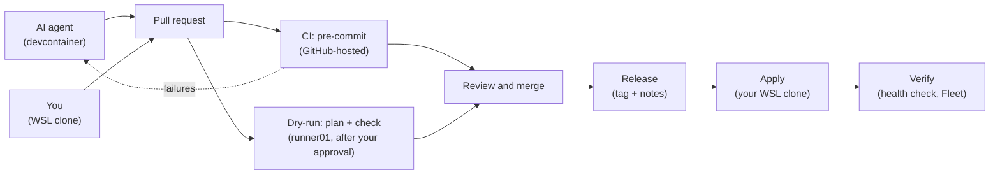

# Contributing

How a change gets from an idea to the homelab, whether you make it or the
AI agent does, and the rules it follows on the way. Setting things up in
the first place is [`docs/SETUP.md`](docs/SETUP.md); this page is the day
to day.

## How a change flows

Every change goes through a pull request. Only you merge, and only you
apply.



**The AI agent's lane**, in its devcontainer
([`docs/DEVCONTAINER.md`](docs/DEVCONTAINER.md)): it branches, makes the
change, runs the checks that need no credentials (`mise run lint`, `tofu
init -backend=false && tofu validate`, `ansible-lint`, `--syntax-check`),
commits and pushes as its machine user, `bcochofel-ai-agent`, and opens the
pull request. It follows CI with `gh pr checks` and pushes fixes to the
same branch. It can't push `.github/workflows/` (those files go in the
pull request's description, for you to add), merge, approve, tag, decrypt
your secrets, or reach a host.

**Your lane**, in your WSL clone: the same branch, commit and pull request
flow, as you. You can run `mise run tofu:plan` for an early look. Yours is
the only lane that can change `.github/workflows/`.

**On the pull request:**

| Workflow | Runs on | When | What |
| --- | --- | --- | --- |
| `ci.yml` | GitHub-hosted | every push | pre-commit on every file, gitleaks on the full history; no credentials |
| `dry-run.yml` | `runner01` | after you approve the `dry-run` environment (*Review deployments → Approve and deploy*) | `tofu plan` if `terraform/` changed, `ansible-playbook --check --diff` if `ansible/` changed; the summary as a comment on the pull request, the full output as an encrypted artifact ([`docs/SETUP.md`](docs/SETUP.md#stage-8-the-dry-run-runner-optional)) |

A new push needs a new approval, of the pull request and of its dry-run,
and cancels the pull request's previous dry-run. A fork's pull request
never reaches the runner.

**Review and merge.** Read the diff and the dry-run's comment, then
approve. Every pull request needs one approval from a code owner, the
`sre-lead` team, and every review conversation resolved
([`docs/SETUP.md`](docs/SETUP.md#rulesets)). **Merge right after you
approve:** once approved, GitHub would let any user with Write merge, the
machine user included. GitHub never lets you approve your own pull
request, nor one whose last push was yours: merge those with the ruleset's
admin bypass, which works only through a pull request. Squash or rebase
merges only (linear history).

**Release.** `release.yml` runs semantic-release on the merge to `main`
(below). Nothing is deployed at this step.

**Apply**, from your WSL clone only:

```bash
git switch main && git pull
mise run tofu:plan        # saves terraform/tfplan; compare it with the pull request's dry-run
mise run tofu:apply       # applies exactly that plan, and writes hosts.ini
mise run ansible:site     # --limit <host or group> to touch only what changed
```

If your plan differs from the pull request's dry-run (a change by hand,
another merge), stop and find out why before applying. Always OpenTofu
first (VMs and inventory), then Ansible.

**Verify.** `site.yml` ends with the health check (`99-healthcheck.yml`):
what this repo deploys fails the run, external dependencies are reported.
Then Fleet and Kibana for the hosts you touched. A problem means a new pull
request, never a live edit on a host.

## Branches

[Trunk-based development](https://trunkbaseddevelopment.com/): `main` is
the trunk, always deployable; work happens on short-lived branches,
deleted after merge. Names follow
[Conventional Branch](https://conventionalbranch.org/) 1.1.0,
`<prefix>/<description>`:

| Prefix | For |
| --- | --- |
| `feature/` (or `feat/`) | new capability |
| `bugfix/` (or `fix/`) | bug fix |
| `hotfix/` | urgent fix |
| `release/` | release preparation |
| `chore/` | non-code work: dependencies, docs, tooling |

Lowercase letters, numbers and hyphens only; dots only in release versions
(`release/v5.1.0`). An AI agent may use the spec's agent prefixes (e.g.
`claude/`). Keep the prefix and the commit type in line: a `feature/`
branch carries `feat:` commits. Keep each pull request to one logical
change.

## Commits and releases

Commit messages follow [Conventional Commits](https://www.conventionalcommits.org/),
checked by commitlint ([`commitlint.config.js`](commitlint.config.js)):
`<type>(optional scope): <subject>`, with type `feat`, `fix`, `docs`,
`style`, `refactor`, `perf`, `test`, `build`, `ci`, `chore` or `revert`.
`git commit` without `-m` opens the repo's template.

[semantic-release](https://semantic-release.gitbook.io/)
([`.releaserc.js`](.releaserc.js)) computes each version from them, on
`main` only:

- `fix:` → patch; `feat:` → minor; `!` after the type or a
  `BREAKING CHANGE:` footer → major;
- `docs:`, `chore:`, `style:` and the rest → no release on their own.

It publishes a GitHub Release with generated notes and a tag, with the
workflow's own token: no `CHANGELOG.md`, nothing pushed to `main`.

## Checks

`mise install` installs the git hooks, so `git commit` runs
[`.pre-commit-config.yaml`](.pre-commit-config.yaml): file hygiene, Packer,
OpenTofu (fmt, validate, terraform-docs, TFLint, Trivy, Checkov),
markdownlint, ansible-lint, ShellCheck, gitleaks, SOPS files encrypted,
actionlint and zizmor on workflows, and commitlint. CI runs the same.

```bash
mise run lint      # every hook on every file
mise run check     # the above + gitleaks on the full history (what CI runs)
```

Two repo-specific rules the hooks enforce:

- **Every `check_mode: false`** says why it's safe on the same line
  (`check_mode: false # read-only: ...`): it runs for real in the CI
  dry-run.
- **Every action in a workflow** is pinned to a commit SHA, with its
  version in a comment.

Silence a ShellCheck finding only with a `# shellcheck disable=SCxxxx`
comment that says why.

## Toolchain

Every command-line tool is pinned in [`mise.toml`](mise.toml), with each
download's checksum in `mise.lock`: your workstation, CI and the
devcontainer run the same versions (CI and the devcontainer install in
locked mode). `mise tasks` lists the repo's commands; `mise run doctor`
shows what's installed.

| Tool | For |
| --- | --- |
| Packer | The VM template ([`docs/PACKER.md`](docs/PACKER.md)). |
| OpenTofu (`tofu`) | The VMs and the inventory ([`docs/TERRAFORM.md`](docs/TERRAFORM.md)); `terraform` is pinned only as a rollback path. |
| Ansible, ansible-lint | Configuring the hosts ([`docs/ANSIBLE.md`](docs/ANSIBLE.md)); in `.venv/`, from `requirements.txt`. |
| Terramate | Parity with homelab-proxmox-workloads; unused here. |
| TFLint, terraform-docs, Trivy, Checkov | Linting, docs and policy for the OpenTofu code. |
| ShellCheck, markdownlint-cli2, actionlint, zizmor | Shell scripts, Markdown, and GitHub workflows (lint and security). |
| gitleaks | No secret committed: staged changes, and the full history in CI. |
| SOPS, age | The encrypted secret files and their keys ([`docs/CREDENTIALS.md`](docs/CREDENTIALS.md)). |
| pre-commit, commitlint, semantic-release | Hooks, commit messages, releases. |
| GitHub CLI (`gh`) | Pull requests and runs; the machine user's in the devcontainer. |
| Python, uv, Node.js | The runtimes for `.venv/` and the Node-based hooks. |
| github-mcp-server, terraform-mcp-server, mcp-proxmox | The AI agent's read-only MCP servers ([`docs/CREDENTIALS.md`](docs/CREDENTIALS.md) step 8). |

Pinned elsewhere, in their own ecosystem's file: Ansible and ansible-lint
(`requirements.txt`, ranges), the Ansible collections
(`ansible/requirements.yml`, minimums), the pre-commit hook repositories
(`.pre-commit-config.yaml`), semantic-release (`package-lock.json`), the
OpenTofu providers (`.terraform.lock.hcl`), Packer's Proxmox plugin
(`versions.pkr.hcl`, minimum), the template's Elastic Agent
(`elastic_agent_version`), the devcontainer image
(`devcontainer.json`), and the workflows' actions (commit SHAs).

**Bumping a version.** Nothing updates on its own: no Dependabot, no
Renovate.

1. `mise run outdated` lists newer versions of the pinned tools and hooks.
2. Edit the pin in `mise.toml` (or the file above), then `mise lock` and
   `MISE_LOCKED=1 mise install`.
3. Read the release notes, run `mise run lint`, and commit the pin with its
   lockfiles.

mise itself is pinned as `MISE_VERSION` in `.devcontainer/post-create.sh`,
which [`docs/SETUP.md`](docs/SETUP.md#stage-1-workstation)'s install
command reads. `terraform-mcp-server`'s entry spells out its URL and
checksum, so its bump updates all three.
