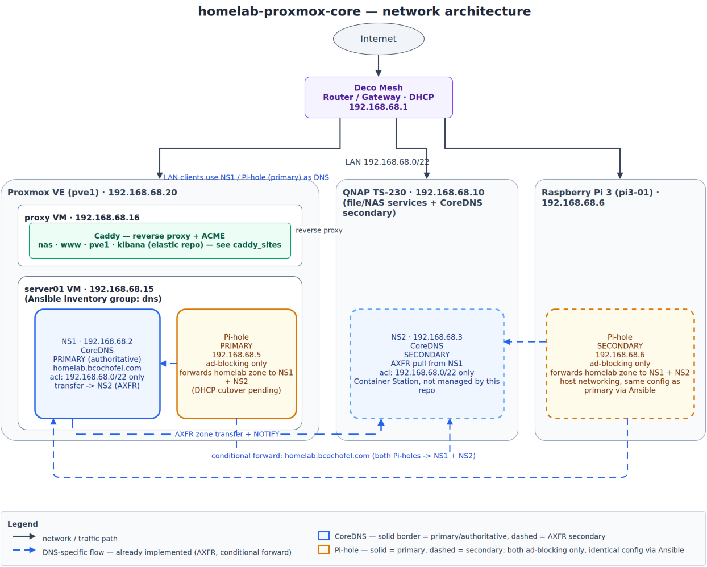

# homelab-proxmox-core

Two VMs on Proxmox (pve1), built with an IaC pipeline: `proxy` (Caddy
reverse proxy) and `server01` — Ansible inventory group `dns` — (CoreDNS +
primary Pihole). A third host, `pi3-01` (a Raspberry Pi 3, Ansible group
`pi3`), runs Pihole's secondary instance — hand-added to the inventory, not
Terraform-managed, see "DNS cutover" below.

```text
Packer (template)  ->  Terraform (clone VMs + generate inventory)  ->  Ansible (configure)
```

## Homelab architecture



Editable source: [`docs/diagrams/architecture.drawio`](docs/diagrams/architecture.drawio)
(open in [app.diagrams.net](https://app.diagrams.net)).

This repo is one of three that make up the homelab:

- **`homelab-proxmox-core`** (this repo) — edge routing and name
  resolution: the Caddy reverse proxy and the CoreDNS + Pihole DNS pair.
- **[`homelab-proxmox-elastic`](https://github.com/bcochofel/homelab-proxmox-elastic)**
  — the Elastic observability stack (Elasticsearch, Kibana, Fleet Server,
  APM Server), built with the same Packer -> Terraform -> Ansible pipeline
  as this repo.
- **[`homelab-proxmox-k3s`](https://github.com/bcochofel/homelab-proxmox-k3s)**
  — a K3s cluster managed via ArgoCD (GitOps), with Traefik as its
  in-cluster ingress.
  It runs the OTel Demo, which feeds telemetry into the
  `homelab-proxmox-elastic` stack — so the cluster is part of the
  observability architecture, not a standalone workload.

## Quickstart

Get both VMs green on Proxmox, end to end. See
[Design decisions](#design-decisions) below for topology and rationale, and
[`CONTRIBUTING.md`](CONTRIBUTING.md) if you're setting this up to
contribute rather than just to run it.

### Prerequisites

- A Proxmox VE node reachable on your LAN, with an Ubuntu Server ISO
  (26.04) already uploaded to its ISO storage.
- Two Proxmox API tokens, each scoped to least privilege for what it does:
  one for Packer (template builds), one for Terraform (clone/configure the
  VMs). See [`docs/PACKER.md`](docs/PACKER.md) for the exact `pveum`
  commands to create the Packer token; Terraform's token setup is in
  [`docs/TERRAFORM.md`](docs/TERRAFORM.md).
- `age` and `sops` installed, plus a `secrets.yaml` at the repo root holding
  the Proxmox tokens and any other credentials the `.envrc` files decrypt
  per directory — see "Secrets management" below for how to set this up.
- `direnv` installed and hooked into your shell.
- `pre-commit` installed if you plan to commit changes (see
  [`CONTRIBUTING.md`](CONTRIBUTING.md)).
- A Cloudflare API token scoped to the `bcochofel.com` zone — **Zone → DNS →
  Edit** + **Zone → Zone → Read** permissions, "Include: Specific zone:
  bcochofel.com" — for Caddy's Let's Encrypt DNS-01 challenge. Create a
  dedicated token for this repo; don't reuse one from another repo.

### Secrets management (SOPS + age)

Every credential this repo needs — Proxmox API tokens, the cloud-init
password hash, the Cloudflare token — lives in one file, `secrets.yaml` at
the repo root, encrypted at rest with [SOPS](https://github.com/getsops/sops)
using an [age](https://github.com/FiloSottile/age) key. Unlike most
`secrets.*` naming conventions, **this file is meant to be committed** —
SOPS encrypts the values in place, so the file in git is ciphertext, safe to
version alongside the code that needs it. What must never be committed is
the age *private* key or a decrypted copy of the file — both are covered by
`.gitignore`.

**First-time setup (generating your own age key):**

```bash
age-keygen -o ~/.config/sops/age/keys.txt
chmod 600 ~/.config/sops/age/keys.txt
```

This prints an age public key (`age1...`). Paste it into [`.sops.yaml`](.sops.yaml)
as the recipient (replacing the placeholder there) before creating
`secrets.yaml` for the first time.

**Creating or editing `secrets.yaml`:**

```bash
sops secrets.yaml
```

This decrypts into a temp file, opens your `$EDITOR`, and re-encrypts on
save. If the file doesn't exist yet, SOPS creates it fresh. Add these keys:

| Key | Used by |
| --- | --- |
| `proxmox_packer_token_id` / `proxmox_packer_token_secret` | Packer |
| `proxmox_terraform_token_id` / `proxmox_terraform_token_secret` | Terraform |
| `tf_cloud_token` | Terraform (HCP Terraform) |
| `cloudinit_password` | Packer + Terraform (cloud-init user password) |
| `cloudflare_api_token` | Ansible (Caddy's DNS-01 ACME) |
| `pihole_webpassword` | Ansible (Pihole admin UI password) |

The ACME account contact email isn't a secret — it's set directly as
`letsencrypt_email` in `ansible/inventory/group_vars/all.yml`, not routed
through `secrets.yaml`.

**Viewing decrypted content (read-only):**

```bash
sops -d secrets.yaml
```

**How `direnv` uses it:** each directory's `.envrc` runs
`sops -d --output-type dotenv secrets.yaml` and exports the result as
environment variables (`PKR_VAR_*` for Packer, `TF_VAR_*` for Terraform,
`CLOUDFLARE_API_TOKEN`/`PIHOLE_WEBPASSWORD` for Ansible). Once `secrets.yaml`
exists and your age key can decrypt it, `direnv allow` (via `make install`)
is all that's needed for those variables to appear automatically when you
`cd` into `packer/`, `terraform/`, etc.

**After editing `secrets.yaml` itself:** no action needed — direnv re-runs
`.envrc` automatically the next time you `cd` into a directory, or
immediately via `direnv reload`.

**After editing any `.envrc` file:** direnv treats a changed `.envrc` as
untrusted and blocks it until re-approved:

```bash
make direnv-allow
```

### 0. Prepare the local environment

```bash
make install
```

Pins the CLI binaries this repo needs (`terraform`, `packer`, `trivy`,
`tflint`, `terraform-docs`, `sops`) into `~/bin`, approves the `.envrc`
files (root, `packer/`, `terraform/`, `ansible/`) via direnv, and creates
the `.venv/` Ansible runs from.

### 1. Build the VM template (Packer)

```bash
make packer-init
cd packer/ubuntu-26.04
cp variables.pkrvars.hcl.example variables.auto.pkrvars.hcl   # fill in, gitignored, auto-loaded
packer build .
```

See [`packer/ubuntu-26.04/README.md`](packer/ubuntu-26.04/README.md) for
what it bakes in and why.

### 2. Clone the VM and generate the inventory (Terraform)

```bash
cd terraform
cp example.tfvars terraform.tfvars   # edit, or set the equivalent HCP workspace variables
terraform init    # one time
terraform plan    # review before applying
terraform apply
```

This clones the Packer template into the `proxy` and `dns` VMs, assigns
each a static IP, and writes `ansible/inventory/hosts.ini` — see
[`docs/TERRAFORM.md`](docs/TERRAFORM.md), including the `pveum` commands to
create the `terraform@pve` token if you haven't already.

### 3. Configure everything (Ansible)

```bash
source .venv/bin/activate   # from repo root
cd ansible
ansible-galaxy collection install -r requirements.yml
ansible-playbook playbooks/site.yml
```

Runs bootstrap -> DNS (macvlan network, CoreDNS, Pihole) -> Caddy (builds
the image via `xcaddy`, renders the Caddyfile, brings up the container) ->
health check. See [`docs/ANSIBLE.md`](docs/ANSIBLE.md) for the role/
playbook breakdown.

**Before this succeeds:** `CLOUDFLARE_API_TOKEN` and `PIHOLE_WEBPASSWORD`
must be set in `secrets.yaml` and exported from `ansible/.envrc` — a
preflight check fails loudly and early if either is missing.

Once done, see [Verify](#verify) below.

### DNS cutover (CoreDNS primary/secondary + Pihole primary/secondary)

CoreDNS is authoritative-**primary** for `homelab.bcochofel.com` at
`192.168.68.2`; Pihole is ad-blocking-only and conditionally forwards that
zone to CoreDNS instead of holding its own copy of the records — as two
independent instances, both configured identically by Ansible
(`inventory/group_vars/pihole.yml`): a **primary** on the `server01` VM at
`192.168.68.5`, and a **secondary** on `pi3-01` (a Raspberry Pi 3, static
IP `192.168.68.6`, host networking rather than macvlan since it's
single-purpose) — for redundancy, same idea as CoreDNS's own
primary/secondary. Note this is *config parity* only — every Ansible-managed
setting (upstreams, conditional-forward targets, password, timezone) is
identical on both, but gravity.db/blocklists aren't replicated between them
(no gravity-sync/Teleporter — considered unnecessary since both start from
Pi-hole's own shipped defaults). A second
CoreDNS instance on the user's QNAP NAS (`192.168.68.3`, its own dedicated
LAN IP via QNAP's own network mechanism — not Docker's macvlan driver) is
an AXFR **secondary** for read redundancy — entirely outside this repo's
automation, see its own setup guide (not checked into this repo; ask the
maintainer for it). Both CoreDNS instances only answer queries from
`192.168.68.0/22`.

1. Provision and verify the `server01` VM (above) — confirm
   `dig @192.168.68.2 nas.homelab.bcochofel.com` and
   `dig @192.168.68.5 nas.homelab.bcochofel.com` both resolve correctly
   (the second via Pihole's conditional forward to the first), and the
   Pihole admin UI (see [Web UIs](#web-uis) below) is reachable.
2. Set up `pi3-01` (Raspberry Pi OS, Docker installed by this repo's
   `common` role) and add it to `ansible/inventory/hosts_static.ini` —
   not Terraform-managed, that file is never regenerated. Confirm
   `dig @192.168.68.6 nas.homelab.bcochofel.com` matches `.5`'s answer.
3. Set up the QNAP-hosted CoreDNS secondary and confirm
   `dig @192.168.68.3 nas.homelab.bcochofel.com` matches, and its SOA
   serial matches the primary's (confirms AXFR landed).
4. Confirm the ACL: a `dig` against `.2`/`.3`/`.5` from outside
   `192.168.68.0/22` should be refused.
5. Point your router/DHCP server's DNS settings at `.2`/`.5`.

### Adding a proxied site

Edit `caddy_sites` in `ansible/inventory/group_vars/all.yml` (add an
`fqdn`/`upstream` pair, optionally `insecure_skip_verify: true` if the
upstream presents a self-signed cert), point that fqdn's DNS record at the
Caddy VM's IP (see [DNS](#dns) below), then re-run
`ansible-playbook playbooks/site.yml` — the Caddyfile template loops over
this list, so no role changes needed.

## Topology

| VM       | vCPU | RAM  | Disk | Role                     | IP                          |
| -------- | ---- | ---- | ---- | ------------------------ | --------------------------- |
| proxy    | 1    | 1 GB | 20 G | Caddy reverse proxy      | 192.168.68.16               |
| server01 | 2    | 2 GB | 20 G | CoreDNS + Pihole primary | 192.168.68.15 (.2/.5 below) |

(`server01` is the VM's Proxmox name/hostname — the Ansible inventory
group is still `dns`.) Two further DNS hosts aren't in this table since
neither is a Terraform-managed VM — see "DNS cutover" above: `pi3-01`
(Raspberry Pi 3, Pihole secondary, `192.168.68.6`, hand-added to
`inventory/hosts_static.ini`) and a CoreDNS secondary on the user's QNAP
NAS (`192.168.68.3`).

`proxy` runs a single-container Docker Compose stack — Caddy, built from a
role-rendered `Dockerfile` with the `caddy-dns/cloudflare` module compiled
in via `xcaddy`, so it can issue its own Let's Encrypt certs via Cloudflare
DNS-01 with no certbot/timer/deploy-hook needed.

`server01` runs two Docker Compose services, CoreDNS and Pihole, each
attached to a shared Docker macvlan network with its own real LAN IP —
`192.168.68.2` (CoreDNS, authoritative primary for `homelab.bcochofel.com`)
and `192.168.68.5` (Pihole primary, ad-blocking + conditional-forward).
Unlike the old `ns1`/`ns2` design, these aren't independent peers: Pihole
forwards the local zone to CoreDNS rather than holding its own copy.
`192.168.68.15` is just the VM's own management IP for SSH/Ansible, not a
DNS-serving address. `pi3-01` runs a single Pihole container (the
secondary) on host networking instead — no macvlan, since it's the only
thing running on that Pi.

## DNS

This repo *does* manage DNS now. `ansible/inventory/group_vars/dns.yml`'s
`dns_hosts` list is the single source of truth for the local zone
(`dns_zone: homelab.bcochofel.com`), rendered into CoreDNS's zone file
(`db.<zone>`, served by the `file` plugin) — edit that list, not either
container directly, to add or change a hostname. CoreDNS transfers the
zone via AXFR to a secondary running on the user's QNAP NAS
(`coredns_secondary_ip`, outside this repo's reach). Neither Pihole
instance (primary on `server01`, secondary on `pi3-01`) holds its own copy
of the zone — both conditionally forward `homelab.bcochofel.com` queries
to both CoreDNS instances (`FTLCONF_dns_revServers`) and otherwise only do
ad-blocking, using the same external resolvers (`dns_forward_resolvers`)
as CoreDNS's catch-all block; `inventory/group_vars/pihole.yml` is the
single source of truth for settings both Pihole instances share, so they
stay identical. Both CoreDNS instances restrict queries to
`192.168.68.0/22` via the `acl` plugin. Every fqdn Caddy manages
(`caddy_sites` in `group_vars/all.yml`) resolves to Caddy's IP
(`192.168.68.16`) here, not its backend — see "Adding a proxied site"
above.

What this repo still does *not* do: touch your router/DHCP server's DNS
settings (a manual step, see "DNS cutover"), manage the QNAP-hosted CoreDNS
secondary (manual, external setup), or manage the public `bcochofel.com`
Cloudflare zone (only used for the ACME DNS-01 TXT challenge, not a
resolvable public A/AAAA record for any of these LAN-only hostnames).

## Web UIs

The only web UI this repo stands up itself (not proxied to another
system) is Pihole's — both instances, same password:

| UI | URL | Login |
| --- | --- | --- |
| Pihole (primary) | <http://192.168.68.5/admin> | Password-only (no username) — the `pihole_webpassword` value from `secrets.yaml` |
| Pihole (secondary, pi3-01) | <http://192.168.68.6/admin> | Same password (`inventory/group_vars/pihole.yml` shares it) |

Pihole's self-signed cert means `https://` will warn in the browser; `http://`
is what "DNS cutover" above uses too. Caddy and CoreDNS have no web UI
of their own — Caddy's whole job is fronting *other* systems' UIs
(`nas`/`www`/`pve1` in `caddy_sites`, all of which depend on
something outside this repo), and CoreDNS only exposes a Prometheus metrics
endpoint (`:9153`), not a dashboard.

## Verify

- `https://nas.homelab.bcochofel.com`, `https://www.homelab.bcochofel.com`,
  `https://pve1.homelab.bcochofel.com` — each should present a real Let's
  Encrypt certificate (issued by Caddy itself) and proxy to its backend.
  (`kibana.homelab.bcochofel.com` omitted here — its backend lives in the
  separate `homelab-proxmox-elastic` repo, so it's only reachable once
  that stack is deployed too.)
- Caddy container: `docker ps` on the `proxy` VM should show `caddy`
  healthy.
- `dig @192.168.68.2 <any dns_hosts fqdn>` (CoreDNS, authoritative) and
  `dig @192.168.68.5 <any dns_hosts fqdn>` (Pihole primary, via
  conditional forward — should match) both resolve. `docker ps` on the
  `server01` VM should show both `coredns` and `pihole` healthy.
  `dig @192.168.68.6 <fqdn>` (Pihole secondary, pi3-01) should match too —
  config parity between the two instances. `dig @192.168.68.3 <fqdn>`
  (the QNAP secondary) matching too is a manual check outside this repo's
  automation. A `dig` from outside `192.168.68.0/22` against `.2`/`.5`
  should be refused (ACL).
- **QNAP secondary AXFR in sync** — confirm the primary and secondary
  agree on the zone, not just that a transfer happened once:

  ```bash
  dig @192.168.68.2 homelab.bcochofel.com SOA
  dig @192.168.68.3 homelab.bcochofel.com SOA
  ```

  Both should return the identical serial and the same `ns1`/`ns2` NS
  records. A mismatched serial means the secondary hasn't picked up the
  primary's latest AXFR/NOTIFY yet — check `docker logs coredns-secondary`
  on the QNAP for the transfer status.

## Design decisions

- **Provider:** `bpg/proxmox`. VM IDs are not hardcoded — `caddy_node`/
  `dns_node`'s `vmid` is optional, so Proxmox auto-assigns the next
  available ID on first create; once a VM exists, its ID stays put
  (`vm_id` is Optional+Computed) even though config no longer pins it.
- **State:** HCP Terraform, workspace `core-caddy`.
- **Caddy runtime:** Docker Compose, image built via `xcaddy` at deploy
  time (not a stock `caddy` image) so the `caddy-dns/cloudflare` module is
  available.
- **TLS:** Caddy's native ACME, DNS-01 via Cloudflare — no certbot.
- **DNS runtime:** CoreDNS is the authoritative primary for
  `homelab.bcochofel.com` (`file`+`transfer`+`acl` plugins), with a
  QNAP-hosted secondary pulling the zone via AXFR for read redundancy.
  Pihole is deliberately chained behind CoreDNS for the local zone
  (conditional forwarding via `FTLCONF_dns_revServers`) while remaining an
  independent ad-blocking resolver for everything else — not the old
  independent `ns1`/`ns2` peer design.
- **Pihole runtime:** two identically-configured instances (config parity
  via `ansible/inventory/group_vars/pihole.yml`, not live gravity.db/
  blocklist sync) — a primary on `server01` (macvlan) and a secondary on
  `pi3-01` (host networking, since it's single-purpose).
- **Inventory:** only `ansible/inventory/hosts.ini` is generated.
  `ansible/inventory/group_vars/` is hand-authored and never overwritten.
  `ansible/inventory/hosts_static.ini` holds hosts Terraform doesn't
  manage (`pi3-01`) — loaded alongside `hosts.ini`, see `ansible.cfg`.
- **Decoupling:** Terraform and Ansible are run as separate, explicit
  commands — no `local-exec` chaining, no Makefile wrapper around either
  write step.
- **Template:** `ubuntu-26.04`, minimal (Docker only).

## Documentation

- [`docs/PACKER.md`](docs/PACKER.md) — VM template build.
- [`docs/TERRAFORM.md`](docs/TERRAFORM.md) — cloning the VM + inventory generation.
- [`docs/ANSIBLE.md`](docs/ANSIBLE.md) — Caddy, CoreDNS, and Pihole
  (primary + secondary) configuration.
- [`CONTRIBUTING.md`](CONTRIBUTING.md) — environment setup, branching, commit
  conventions, and versioning for contributors.
- [`TODO.md`](TODO.md) — phase-by-phase roadmap and current status.

## References

- [Proxmox VE Documentation](https://pve.proxmox.com/pve-docs/)
- [Proxmox Cloud-Init Support](https://pve.proxmox.com/wiki/Cloud-Init_Support)
- [Caddy Documentation](https://caddyserver.com/docs/)
- [caddy-dns/cloudflare](https://github.com/caddy-dns/cloudflare)
