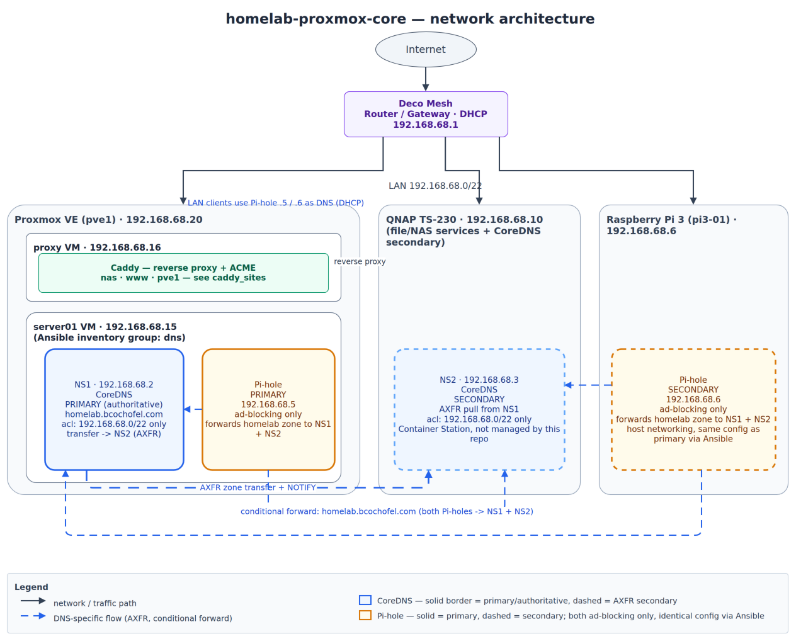

# homelab-proxmox-core

Two VMs on Proxmox, built with an IaC pipeline: `proxy` (Caddy
reverse proxy) and `server01` — Ansible inventory group `dns` — (CoreDNS +
primary Pihole). A third host, `pi3-01` (a Raspberry Pi 3, Ansible group
`pi3`), runs Pihole's secondary instance — hand-added to the inventory, not
Terraform-managed, see "Test DNS and configure your network" below.

```text
Packer (template)  ->  Terraform (clone VMs + generate inventory)  ->  Ansible (configure)
```

## Homelab architecture



Editable source: [`docs/diagrams/architecture.drawio`](docs/diagrams/architecture.drawio)
(open in [app.diagrams.net](https://app.diagrams.net)).

This repo is one of two that make up the homelab:

- **`homelab-proxmox-core`** (this repo) — edge routing and name
  resolution: the Caddy reverse proxy and the CoreDNS + Pihole DNS pair.
- **[`homelab-proxmox-workloads`](https://github.com/BCochofelHomelab/homelab-proxmox-workloads)**
  — everything that runs behind it: the Elastic observability stack and
  the K3s cluster (ArgoCD, Traefik, OTel Demo), managed with OpenTofu and
  Terramate.

## Quickstart

Get both VMs green on Proxmox, end to end. See
[Design decisions](#design-decisions) below for topology and rationale, and
[`CONTRIBUTING.md`](CONTRIBUTING.md) if you're setting this up to
contribute rather than just to run it.

### Prerequisites

- A Proxmox VE node reachable on your LAN, with an Ubuntu Server ISO
  (26.04) already uploaded to its ISO storage.
- Credentials set up as described in
  [`docs/CREDENTIALS.md`](docs/CREDENTIALS.md): the Proxmox roles, users
  and tokens (one per role: Packer, console, read-only AI agent), the HCP
  Terraform tokens, the SOPS-encrypted secret files, and the shell
  helpers (`hl_ro`, `packer_rw`, `tofu_rw`) the steps below use.
- A Cloudflare API token for Caddy's Let's Encrypt DNS-01 challenge,
  limited to the `bcochofel.com` zone with **DNS Write** and **Zone Read**
  (Cloudflare's *DNS and Zones* permission group) —
  dedicated to this repo. Step-by-step in
  [`docs/CREDENTIALS.md`](docs/CREDENTIALS.md#3-cloudflare-api-token).

### Credentials

Nothing is exported into your shell automatically. Read-only credentials
are loaded on request (`hl_ro`); write credentials are passed to exactly
one command by a wrapper and never exported. Proxmox and HCP credentials
live in `~/.secrets/` (outside the repo, because they're shared); Ansible's
secrets (Cloudflare token, Pihole password) are inventory variables in
SOPS-encrypted `ansible/inventory/group_vars/<group>.sops.yaml` files,
which are meant to be committed. The ACME account email isn't a secret —
it's `letsencrypt_email` in `ansible/inventory/group_vars/all.yml`. Full
procedure: [`docs/CREDENTIALS.md`](docs/CREDENTIALS.md).

### 0. Prepare the local environment

Needs [mise](https://mise.jdx.dev) (activated in your shell); everything
else is pinned in `mise.toml`.

```bash
mise trust && mise install
```

Installs every pinned tool (OpenTofu's `tofu`, `terramate`, `packer`,
`trivy`, `tflint`, `terraform-docs`, `gitleaks`, `checkov`, `sops`, `age`,
`pre-commit`),
creates the `.venv/` Ansible runs from (activated automatically whenever
you `cd` into the repo) with Ansible and its collections installed, and
installs the git hooks. `mise tasks` lists the other setup
tasks — see [`CONTRIBUTING.md`](CONTRIBUTING.md).

### 1. Build the VM template (Packer)

```bash
cd packer/ubuntu-26.04
cp variables.pkrvars.hcl.example variables.auto.pkrvars.hcl   # fill in, gitignored, auto-loaded
packer init .    # one time: plugin download
packer_rw build .
```

See [`packer/ubuntu-26.04/README.md`](packer/ubuntu-26.04/README.md) for
what it bakes in and why.

### 2. Clone the VM and generate the inventory (Terraform)

```bash
cd terraform
cp example.tfvars terraform.tfvars   # edit, or set the equivalent HCP workspace variables
hl_ro          # read-only credentials
tofu init      # one time
tofu_rw plan   # review before applying
tofu_rw apply
```

This clones the Packer template into the `proxy` and `dns` VMs, assigns
each a static IP, and writes `ansible/inventory/hosts.ini` — see
[`docs/TERRAFORM.md`](docs/TERRAFORM.md).

### 3. Configure everything (Ansible)

```bash
cd ansible   # .venv/ is active via mise; collections came with mise install
ansible-playbook playbooks/site.yml
```

Runs bootstrap -> DNS (macvlan network, CoreDNS, Pihole) -> Caddy (builds
the image via `xcaddy`, renders the Caddyfile, brings up the container) ->
health check. See [`docs/ANSIBLE.md`](docs/ANSIBLE.md) for the role/
playbook breakdown.

**Before this succeeds:** `cloudflare_api_token`
(`ansible/inventory/group_vars/caddy.sops.yaml`) and `pihole_webpassword`
(`ansible/inventory/group_vars/pihole.sops.yaml`) must be set — Ansible
decrypts both at task time; a preflight check fails loudly and early if
either is missing.

Once done, see [Verify](#verify) below.

### Test DNS and configure your network

#### Who does what

Two layers, each with a primary and a secondary. "Primary/secondary"
means something different in each:

| Server | IP | Host | Role |
| --- | --- | --- | --- |
| CoreDNS `ns1` | `192.168.68.2` | `server01` | **Authoritative primary** for `homelab.bcochofel.com`: serves the zone from `dns_hosts` and pushes every change to the secondary (AXFR + NOTIFY). Forwards every other name to `1.1.1.1`/`8.8.8.8` |
| CoreDNS `ns2` | `192.168.68.3` | QNAP NAS | **Authoritative secondary**: a read-only copy of the same zone, pulled from `ns1`, with the same forwarders. Runs in Container Station, set up by hand: [`docs/COREDNS-SECONDARY.md`](docs/COREDNS-SECONDARY.md) |
| Pi-hole | `192.168.68.5` | `server01` | **Primary resolver** for clients: ad-blocking, forwards `homelab.bcochofel.com` to `ns1`/`ns2` and everything else to `1.1.1.1`/`8.8.8.8` |
| Pi-hole | `192.168.68.6` | `pi3-01` | **Secondary resolver**: identical configuration to `.5` (same Ansible variables), so clients get the same answers from either |

- **Authoritative** means CoreDNS *owns* the `homelab.bcochofel.com`
  records and answers for them with authority. That subdomain exists only
  on these servers: it isn't published in the public `bcochofel.com`
  zone, so a client using `1.1.1.1` directly can't resolve it.
- **CoreDNS is also a full resolver.** For any name outside the local
  subdomain it forwards to its own upstreams, `1.1.1.1` and `8.8.8.8`
  (`dns_forward_resolvers`), with a cache. It answers only clients in
  `192.168.68.0/22`.
- The **Pi-holes** own no records. They're what clients talk to: they
  check blocklists, forward any `homelab.bcochofel.com` name to CoreDNS
  (`ns1` and `ns2`, via Pi-hole's conditional forwarding,
  `FTLCONF_dns_revServers`), and send everything else straight to the
  same `1.1.1.1`/`8.8.8.8` upstreams — not through CoreDNS.

So, from a client's point of view:

```text
client ─► Pi-hole (.5 / .6) ─┬─ blocklisted?          ─► 0.0.0.0
                             ├─ *.homelab.bcochofel.com ─► CoreDNS ns1 (.2) / ns2 (.3)
                             └─ anything else          ─► 1.1.1.1 / 8.8.8.8

client ─► CoreDNS (.2 / .3) ─┬─ *.homelab.bcochofel.com ─► answered from the zone
   (bypassing Pi-hole)       └─ anything else          ─► 1.1.1.1 / 8.8.8.8
```

`pi3-01` must already be in `ansible/inventory/hosts_static.ini` and
configured by the playbook run above, and the QNAP secondary set up
([`docs/COREDNS-SECONDARY.md`](docs/COREDNS-SECONDARY.md)), before every
check below can pass.

#### Test the servers

Run these from a LAN machine, **not** from `server01` itself: Docker's
macvlan driver blocks a host from reaching its own containers' IPs, so
`.2` and `.5` never answer from `server01`.

```bash
# 1. Authoritative answers. Both should return 192.168.68.16 with the "aa"
#    (authoritative answer) flag.
dig @192.168.68.2 nas.homelab.bcochofel.com
dig @192.168.68.3 nas.homelab.bcochofel.com

# 2. Primary and secondary hold the same zone: identical serial numbers.
dig @192.168.68.2 homelab.bcochofel.com SOA +short
dig @192.168.68.3 homelab.bcochofel.com SOA +short

# 3. Both Pi-holes resolve local names (forwarded to CoreDNS, so no "aa")...
dig @192.168.68.5 nas.homelab.bcochofel.com +short
dig @192.168.68.6 nas.homelab.bcochofel.com +short

# 4. ...and the internet...
dig @192.168.68.5 example.com +short
dig @192.168.68.6 example.com +short

# 5. ...and block ads: a blocklisted domain returns 0.0.0.0.
dig @192.168.68.5 doubleclick.net +short
dig @192.168.68.6 doubleclick.net +short

# 6. CoreDNS forwards internet names itself (what bypassing Pi-hole relies on),
#    and doesn't block ads: this returns a real address.
dig @192.168.68.2 example.com +short
dig @192.168.68.3 example.com +short
dig @192.168.68.2 doubleclick.net +short
```

If the serials in check 2 differ, the secondary hasn't picked up the latest
change yet; check `docker logs coredns-secondary` on the NAS. CoreDNS also
refuses queries from outside `192.168.68.0/22`, which you can only see from
a client on another subnet.

#### Configure your network

1. **Router / DHCP server:** set the DNS servers handed to clients to
   **`192.168.68.5`** (primary) and **`192.168.68.6`** (secondary): the two
   Pi-holes. Don't hand out a CoreDNS address alongside them: clients
   don't reliably prefer the first server, so a mixed pair makes
   ad-blocking hit or miss.
2. **Search domain** (optional): if the DHCP server can set one (DHCP
   option 15), use `homelab.bcochofel.com` so short names like `nas`
   resolve.
3. **Renew the lease on a client** (reconnect, or `sudo dhclient -r && sudo
   dhclient` on Linux), then check it uses the Pi-holes: `resolvectl
   status` on Linux, `ipconfig /all` on Windows. `nslookup
   nas.homelab.bcochofel.com` should return `192.168.68.16`, and the
   query should appear in the Pi-hole query log.
4. **Hosts with static DNS settings** don't pick this up from DHCP; set
   them to `.5`/`.6` by hand. The VMs this repo builds are already
   configured by cloud-init (OpenTofu's `nameserver` variable), except
   `server01`, which has to use public resolvers because it can't reach
   its own containers.

**Bypassing Pi-hole:** because CoreDNS forwards everything outside the
local subdomain itself, a device (or the whole network) can use CoreDNS
directly — set its DNS servers to `192.168.68.2` and `192.168.68.3`. It
still resolves local and internet names, just without ad-blocking. Check 6
above confirms both CoreDNS servers forward; `ns2`'s configuration lives
on the NAS, outside this repo, so it's the one to watch.

### Adding a proxied site

Edit `caddy_sites` in `ansible/inventory/group_vars/all.yml` (add an
`fqdn`/`upstream` pair, optionally `insecure_skip_verify: true` if the
upstream presents a self-signed cert), point that fqdn's DNS record at the
Caddy VM's IP (see [DNS](#dns) below), then re-run
`ansible-playbook playbooks/site.yml` — the Caddyfile template loops over
this list, so no role changes needed.

## Topology

| VM       | vCPU | RAM  | Disk | Role                     | IP                          |
| -------- | ---- | ---- | ---- | ------------------------ | --------------------------- |
| proxy    | 1    | 1 GB | 50 G | Caddy reverse proxy      | 192.168.68.16               |
| server01 | 2    | 2 GB | 50 G | CoreDNS + Pihole primary | 192.168.68.15 (.2/.5 below) |

(`server01` is the VM's Proxmox name/hostname — the Ansible inventory
group is still `dns`.) Two further DNS hosts aren't in this table since
neither is a Terraform-managed VM — see "Test DNS and configure your
network" above: `pi3-01`
(Raspberry Pi 3, Pihole secondary, `192.168.68.6`, hand-added to
`inventory/hosts_static.ini`) and a CoreDNS secondary on the user's QNAP
NAS (`192.168.68.3`).

`proxy` runs a single-container Docker Compose stack — Caddy, built from a
role-rendered `Dockerfile` with the `caddy-dns/cloudflare` module compiled
in via `xcaddy`, so it can issue its own Let's Encrypt certs via Cloudflare
DNS-01 with no certbot/timer/deploy-hook needed.

`server01` runs two Docker Compose services, CoreDNS and Pihole, each
attached to a shared Docker macvlan network with its own real LAN IP —
`192.168.68.2` (CoreDNS, authoritative primary for `homelab.bcochofel.com`)
and `192.168.68.5` (Pihole primary, ad-blocking + conditional-forward).
These aren't independent peers: Pihole forwards the local zone to CoreDNS
rather than holding its own copy.
`192.168.68.15` is just the VM's own management IP for SSH/Ansible, not a
DNS-serving address. `pi3-01` runs a single Pihole container (the
secondary) on host networking instead — no macvlan, since it's the only
thing running on that Pi.

## DNS

This repo manages DNS. `ansible/inventory/group_vars/dns.yml`'s
`dns_hosts` list is the single source of truth for the local zone
(`dns_zone: homelab.bcochofel.com`), rendered into CoreDNS's zone file
(`db.<zone>`, served by the `file` plugin) — edit that list, not either
container directly, to add or change a hostname. CoreDNS transfers the
zone via AXFR to a secondary running on the user's QNAP NAS
(`coredns_secondary_ip`, outside this repo's reach). Neither Pihole
instance (primary on `server01`, secondary on `pi3-01`) holds its own copy
of the zone — both conditionally forward `homelab.bcochofel.com` queries
to both CoreDNS instances (`FTLCONF_dns_revServers`) and otherwise only do
ad-blocking, using the same external resolvers (`dns_forward_resolvers`)
as CoreDNS's catch-all block; `inventory/group_vars/pihole.yml` is the
single source of truth for settings both Pihole instances share, so they
stay identical. Both CoreDNS instances restrict queries to
`192.168.68.0/22` via the `acl` plugin. Every fqdn Caddy manages
(`caddy_sites` in `group_vars/all.yml`) resolves to Caddy's IP
(`192.168.68.16`) here, not its backend — see "Adding a proxied site"
above.

What this repo still does *not* do: touch your router/DHCP server's DNS
settings (a manual step, see "Test DNS and configure your network"),
manage the QNAP-hosted CoreDNS
secondary (set up by hand, see
[`docs/COREDNS-SECONDARY.md`](docs/COREDNS-SECONDARY.md)), or manage the public `bcochofel.com`
Cloudflare zone (only used for the ACME DNS-01 TXT challenge, not a
resolvable public A/AAAA record for any of these LAN-only hostnames).

## Web UIs

The only web UI this repo stands up itself (not proxied to another
system) is Pihole's — both instances, same password:

| UI | URL | Login |
| --- | --- | --- |
| Pihole (primary) | <http://192.168.68.5/admin> | Password-only (no username) — the `pihole_webpassword` value from `ansible/inventory/group_vars/pihole.sops.yaml` |
| Pihole (secondary, pi3-01) | <http://192.168.68.6/admin> | Same password (`inventory/group_vars/pihole.yml` shares it) |

Pihole's self-signed cert means `https://` will warn in the browser; use
`http://`. Caddy and CoreDNS have no web UI
of their own — Caddy's whole job is fronting *other* systems' UIs
(`nas`/`www`/`pve1` in `caddy_sites`, all of which depend on
something outside this repo), and CoreDNS only exposes a Prometheus metrics
endpoint (`:9153`), not a dashboard.

## Verify

- `https://nas.homelab.bcochofel.com`, `https://www.homelab.bcochofel.com`,
  `https://pve1.homelab.bcochofel.com` — each should present a real Let's
  Encrypt certificate (issued by Caddy itself) and proxy to its backend.
- Caddy container: `docker ps` on the `proxy` VM should show `caddy`
  healthy.
- `docker ps` on the `server01` VM should show both `coredns` and
  `pihole` healthy (and `pihole` on `pi3-01`).
- DNS: run the checks in
  [Test DNS and configure your network](#test-dns-and-configure-your-network).

## Design decisions

- **Provider:** `bpg/proxmox`. VM IDs are not hardcoded — `caddy_node`/
  `dns_node`'s `vmid` is optional, so Proxmox auto-assigns the next
  available ID on first create; once a VM exists, its ID stays put
  (`vm_id` is Optional+Computed) even though config doesn't pin it.
- **State:** HCP Terraform, workspace `core-caddy`.
- **Caddy runtime:** Docker Compose, image built via `xcaddy` at deploy
  time (not a stock `caddy` image) so the `caddy-dns/cloudflare` module is
  available.
- **TLS:** Caddy's native ACME, DNS-01 via Cloudflare — no certbot.
- **DNS runtime:** CoreDNS is the authoritative primary for
  `homelab.bcochofel.com` (`file`+`transfer`+`acl` plugins), with a
  QNAP-hosted secondary pulling the zone via AXFR for read redundancy.
  Pihole is deliberately chained behind CoreDNS for the local zone
  (conditional forwarding via `FTLCONF_dns_revServers`) while remaining an
  independent ad-blocking resolver for everything else.
- **Pihole runtime:** two identically-configured instances (config parity
  via `ansible/inventory/group_vars/pihole.yml`, not live gravity.db/
  blocklist sync) — a primary on `server01` (macvlan) and a secondary on
  `pi3-01` (host networking, since it's single-purpose).
- **Inventory:** only `ansible/inventory/hosts.ini` is generated.
  `ansible/inventory/group_vars/` is hand-authored and never overwritten.
  `ansible/inventory/hosts_static.ini` holds hosts Terraform doesn't
  manage (`pi3-01`) — loaded alongside `hosts.ini`, see `ansible.cfg`.
- **Decoupling:** Terraform and Ansible are run as separate, explicit
  commands — no `local-exec` chaining, no mise task wrapping either
  write step.
- **Template:** `ubuntu-26.04`, minimal (Docker only).

## Documentation

- [`docs/CREDENTIALS.md`](docs/CREDENTIALS.md) — Proxmox/HCP identities,
  secret files, and how credentials reach each tool.
- [`docs/PACKER.md`](docs/PACKER.md) — VM template build.
- [`docs/TERRAFORM.md`](docs/TERRAFORM.md) — cloning the VM + inventory generation.
- [`docs/ANSIBLE.md`](docs/ANSIBLE.md) — Caddy, CoreDNS, and Pihole
  (primary + secondary) configuration.
- [`docs/COREDNS-SECONDARY.md`](docs/COREDNS-SECONDARY.md) — the CoreDNS
  secondary on the QNAP (Container Station), set up by hand.
- [`CONTRIBUTING.md`](CONTRIBUTING.md) — environment setup, branching, commit
  conventions, and versioning for contributors.
- [`TODO-SRE-AI.md`](TODO-SRE-AI.md) — homelab-wide SRE AI-autonomy
  roadmap (this repo + `homelab-proxmox-workloads`).

## References

- [Proxmox VE Documentation](https://pve.proxmox.com/pve-docs/)
- [Proxmox Cloud-Init Support](https://pve.proxmox.com/wiki/Cloud-Init_Support)
- [Caddy Documentation](https://caddyserver.com/docs/)
- [caddy-dns/cloudflare](https://github.com/caddy-dns/cloudflare)
- [Trunk-based development](https://trunkbaseddevelopment.com/) — the
  branching model: short-lived branches merged into `main`
- [Conventional Branch](https://conventionalbranch.org/) — branch naming
  (see [`CONTRIBUTING.md`](CONTRIBUTING.md))
- [Conventional Commits](https://www.conventionalcommits.org/) — commit
  messages and release versioning
- [Semantic Versioning](https://semver.org/) — the version scheme releases
  follow
- [semantic-release](https://semantic-release.gitbook.io/) — computes and
  publishes releases from the commit history
- [pre-commit](https://pre-commit.com/) — the git hook framework running
  the checks in `.pre-commit-config.yaml`
