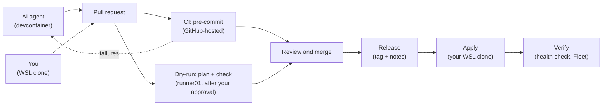

# Workflow

How a change gets from an idea to the homelab, whether you make it or the
AI agent does. Every change goes through a pull request; only you merge,
and only you apply.



## The AI agent's lane: the devcontainer

1. You ask in the Claude Code panel. The AI agent creates a branch
   (`feat/...`, `fix/...`), makes the change and runs the checks that need
   no credentials: `mise run lint`, `tofu init -backend=false && tofu
   validate`, `ansible-lint`, `--syntax-check`.
2. It commits as `bcochofel-ai-agent`; the container's hooks run
   pre-commit and commitlint.
3. It pushes and opens the pull request, as its machine user
   ([`GITHUB.md`](GITHUB.md)).
4. It follows CI with `gh pr checks`; on a failure it reads `gh run view
   --log-failed` and pushes a fix to the same branch. It reads the
   dry-run's summary, and its encrypted full output
   ([`RUNNER.md`](RUNNER.md#output-the-logs-are-public)).
5. It can't push `.github/workflows/` (those files go in the pull
   request's description, for you to add), merge, approve, tag, decrypt
   your secrets, or reach any host over SSH.

## Your lane: your WSL clone

Same flow, as you, with your own hooks: branch, commit, pull request. You
can run `mise run tofu:plan` locally for an early look. Yours is the only
lane that can change `.github/workflows/`. GitHub never lets you approve
your own pull request, so you merge yours with the ruleset's admin bypass.

## On the pull request

| Workflow | Runs on | When | What |
| --- | --- | --- | --- |
| `ci.yml` | GitHub-hosted | Every push, automatically | pre-commit on every file, gitleaks on the full history; no credentials |
| `dry-run.yml` | `runner01` | After you approve the `dry-run` environment (*Review deployments → Approve*) | `tofu plan` if `terraform/` changed, `ansible-playbook --check --diff` if `ansible/` changed; a summary on the run page, the full output as an encrypted artifact |

Every new push needs a new approval, both of the pull request and of its
dry-run. A pull request from a fork never reaches the runner.

## Review and merge

Read the diff and the dry-run summary, then approve. **Merge right after
approving**: once approved, GitHub would let any user with Write merge,
the machine user included; only the AI agent's settings stop it. Squash or
rebase merges only.

## Release

`release.yml` runs semantic-release on the merge to `main`: a `vX.Y.Z` tag
and release notes from the commit messages. Nothing is deployed at this
step.

## Apply: your WSL clone only

```bash
git switch main && git pull
mise run tofu:plan        # saves terraform/tfplan; compare it with the pull request's dry-run
mise run tofu:apply       # applies exactly that plan, and writes hosts.ini
mise run ansible:site     # --limit <host or group> to touch only what changed
```

If your plan differs from the pull request's dry-run (someone changed
something by hand, or another merge landed), stop and find out why before
applying. Always OpenTofu first (VMs and inventory), then Ansible
(configuration).

## Verify

`site.yml` ends with the health check (`99-healthcheck.yml`): what this
repo deploys fails the run, external dependencies are reported. Then
Fleet and Kibana for the hosts you touched. A problem means a new pull
request, never a live edit on a host.
